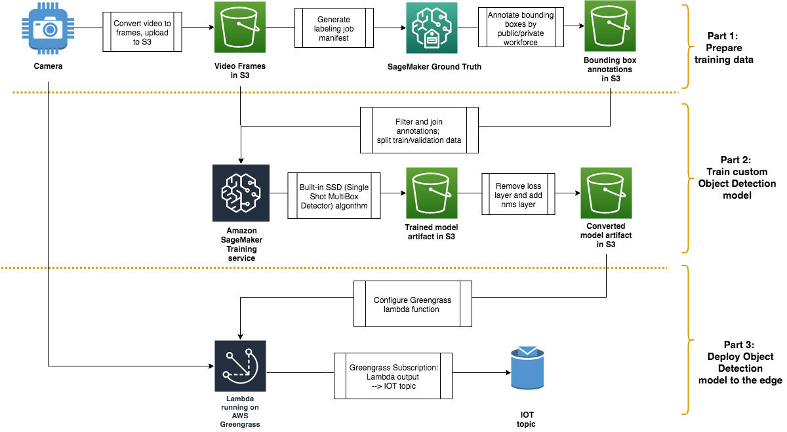

# Training the Built-In Object Detection Model in Amazon SageMaker and running it on AWS IoT Greengrass

End to end code samples for training an object detection model in Amazon SageMaker using the built-in SSD algorithm and running it on AWS IoT Greengrass.


**Object detection** is the process of identifying and localizing objects in an image. A typical object detection solution takes in an image as input and provides a bounding box on the image where an object of interest is, along with identifying what object the box encapsulates.

Many scenarios of object detection happen in places with limited connectivity/bandwidth to internet. Therefore, running object detection at the IoT Edge is a often a solution in these use cases. 

This repo contains useful scripts and Juypter notebooks from collecting training data from a webcam to data labeling, to building an object detection model using built-in SSD model from Amazon SageMaker, and finally, deploying it to run and make inference the edge using AWS IoT Greengrass.
  
  
## Accompanying Blog posts 

This repo supports the 3-part blog post on AWS IoT blog: **Training the Amazon SageMaker object detection model and running it on AWS IoT Greengrass**

* Part 1: https://aws.amazon.com/blogs/iot/sagemaker-object-detection-greengrass-part-1-of-3/
* Part 2: https://aws.amazon.com/blogs/iot/sagemaker-object-detection-greengrass-part-2-of-3/
* Part 3: https://aws.amazon.com/blogs/iot/sagemaker-object-detection-greengrass-part-3-of-3/
  
## Architecture 


## Sections

The repo is organized into 3 sections:

1. [Training Dataset Preperation](./data-prep)
1. [Training Custom Object Detection Model using SageMaker Built-in Algorithm](./training)
1. [Deploy to IoT edge](./greengrass)

The scripts in each of these folders are prefixed with a number. The number in the prefix represents the order the scripts should be used in. E.g.

```
data-prep/
├── 00_get_video.py
├── 01_video_to_frame_utils.py
├── 02_generate_gt_manifest.py
├── 03_visualize_gt_labeling_manifest.py
├── 04_create_ground_truth_job.ipynb
├── 05_visualize_ground_truth_labels.py
```


## License Summary

This sample code is made available under the MIT-0 license. See the LICENSE file.
