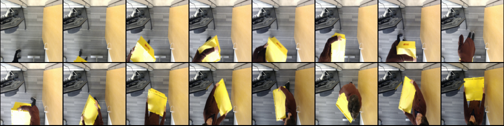

# Steps and Scripts for data preparation

### End-to-end walkthrough

End-to-end walkthrough notebook: [Data prep tutorial with sample video](./Data%20prep%20tutorial%20with%20sample%20video.ipynb)

### README on individual scripts
1. [Capture video from web cam](#00_get_video)
1. [Extracting frames from video and uploading to s3](#01_video_to_frame_utils)
1. [Generate Ground Truth Labeling manifest](#02_generate_gt_manifest)
1. [Visualize the Labeling job manifest](#03)
1. [Submit Ground Truth labeling job](#04)

### <a name="00_get_video"></a> Capture video from web cam 


```bash
pip install -r requirements.txt
python 00_get_video.py -n <name-of-video> -c <camera-id>
```

use `q` to stop recording

### <a name="01_video_to_frame_utils"></a> Extracting frames from video and uploading to s3 
 

```bash
$ python 01_video_to_frame_utils.py -h
usage: 01_video_to_frame_utils.py [-h] -k VIDEO_S3_KEY -b VIDEO_S3_BUCKET
                                  [-d WORKING_DIRECTORY] [-v VISUALIZE_VIDEO]
                                  -o OUTPUT_S3_BUCKET
                                  [-r VISUALIZE_SAMPLE_RATE] [-u]
                                  [-p FRAME_PREFIX] [-c CLEANUP_FILES]
                                  [-pp VIDEO_PREVIEW_PREFIX]

optional arguments:
  -h, --help            show this help message and exit
  -k VIDEO_S3_KEY, --video_s3_key VIDEO_S3_KEY
                        S3 key of the video
  -b VIDEO_S3_BUCKET, --video_s3_bucket VIDEO_S3_BUCKET
                        S3 bucket of the video
  -d WORKING_DIRECTORY, --working_directory WORKING_DIRECTORY
                        the root directory to store video and frames
  -v VISUALIZE_VIDEO, --visualize_video VISUALIZE_VIDEO
                        Whether to generate a preview for the frames in the
                        video.
  -o OUTPUT_S3_BUCKET, --output_s3_bucket OUTPUT_S3_BUCKET
                        S3 bucket to store outputs
  -r VISUALIZE_SAMPLE_RATE, --visualize_sample_rate VISUALIZE_SAMPLE_RATE
                        For visualizing the video, how frequent (in seconds)
                        to sample the frames. default to sample every second.
  -u, --upload_frames   Whether to have the script upload the frames. If you
                        choose not to, the frames will be stored on local disk
                        and you can use e.g. s3 sync command line tool to
                        upload them into S3 in bulk.
  -p FRAME_PREFIX, --frame_prefix FRAME_PREFIX
                        the S3 prefix to upload the extracted frames
  -c CLEANUP_FILES, --cleanup_files CLEANUP_FILES
                        whether to automatically clean up the files in the
                        end. If the frames were not uploaded to S3, they will
                        be kept on local disk even if this is set to true
  -pp VIDEO_PREVIEW_PREFIX, --video_preview_prefix VIDEO_PREVIEW_PREFIX
                        the S3 prefix to upload the video
                        preview/visualization. default is previews/video/
                        
```

For example:

```bash
mkdir tmp
VIDEO_S3_BUCKET=greengrass-object-detection-blog
VIDEO_S3_KEY=videos/blue_box_1.mp4
OUTPUT_S3_BUCKET=<your-bucket-name>
python 01_video_to_frame_utils.py --video_s3_bucket $VIDEO_S3_BUCKET --video_s3_key $VIDEO_S3_KEY --working_directory tmp/ --visualize_video True --visualize_sample_rate 1 -o $OUTPUT_S3_BUCKET
```

Once frames are extracted from videos, we can simply use s3 sync to upload them S3 (The script above can also upload to S3 if you use the `-u` flag. However, `s3 sync` is more performant): 

```bash
aws s3 sync tmp/yellow_box_2/ s3://{bucket-name}/frames/yellow_box_2/
```

### Review contents of your extracted frames 

As part of the `01_video_to_frame_utils.py` script, it generates a preview of the video by putting together thumbnails of frames sampled at certain interval. It should be named similar to `yellow_box_2-preview.png` in your working directory (`./tmp/`)
 
For example: 


Review the visualization to:

* Verify if the quality of the image/field of vision meets your goal: if not, retake the video. 
* Confirm whether the frames contain Personally Identifiable Information (PII): if yes, consider either filtering out the frames containing PII or choosing only a private workforce to label your data  
* Determine whether the frames contain any company confidential information: if yes, either redact/filter out the confidential information, or choosing only a private workforce to label your data  
* Decide if there are too many “empty” frames (ie. background only) that don't contain the objects you are trying to detect

### <a name="02_generate_gt_manifest"></a> Generate Ground Truth Labeling manifest 


If you decide this video contains frames you want to have labeled, we need to generate a manifest file for Ground Truth Labeling job.

Script usage: 

```bash
$ python 02_generate_gt_manifest.py -h
usage: 02_generate_gt_manifest.py [-h] -k FRAMES_S3_PREFIX
                                  [-b FRAMES_S3_BUCKET] [-r SAMPLING_RATE]
                                  [-d WORKING_DIRECTORY]

optional arguments:
  -h, --help            show this help message and exit
  -k FRAMES_S3_PREFIX, --frames_s3_prefix FRAMES_S3_PREFIX
                        S3 prefix of the frames
  -b FRAMES_S3_BUCKET, --frames_s3_bucket FRAMES_S3_BUCKET
                        S3 bucket of the frames
  -r SAMPLING_RATE, --sampling_rate SAMPLING_RATE
                        Sample one out of how many frames. e.g. 1 means use
                        every frame. 30 means 1 out of every 30 frames will be
                        used. Default to 1
  -d WORKING_DIRECTORY, --working_directory WORKING_DIRECTORY
                        the directory to store files
```

Example:

```bash
S3_BUCKET=<your-bucket-name>
S3_KEY_PREFIX=<s3-key-prefix-of-uploaded-frames>
SAMPLING_RATE=5
python data-prep/02_generate_gt_manifest.py -b $S3_BUCKET -k $S3_KEY_PREFIX -r $SAMPLING_RATE -d tmp/
```

### <a name="03"></a> Visualize the Labeling job manifest
 

Before we submit the Ground Truth labeling job, check the set of images you want labeled by visualizing the thumbnails of images included in the manifest

Script usage:

```bash
$ python 03_visualize_gt_labeling_manifest.py -h
usage: 03_visualize_gt_labeling_manifest.py [-h] -k MANIFEST_S3_KEY -b
                                            MANIFEST_S3_BUCKET
                                            [-d WORKING_DIRECTORY]
                                            [-i IMAGE_DIRECTORY]
                                            [-p PREVIEW_PREFIX]

optional arguments:
  -h, --help            show this help message and exit
  -k MANIFEST_S3_KEY, --manifest_s3_key MANIFEST_S3_KEY
                        S3 key of the manifest
  -b MANIFEST_S3_BUCKET, --manifest_s3_bucket MANIFEST_S3_BUCKET
                        S3 bucket of the manifest
  -d WORKING_DIRECTORY, --working_directory WORKING_DIRECTORY
                        the root directory to store video and frames
  -i IMAGE_DIRECTORY, --image_directory IMAGE_DIRECTORY
                        If the frames are on local disk, location to the image
                        (this will avoid downloading the images agin)
  -p PREVIEW_PREFIX, --preview_prefix PREVIEW_PREFIX
                        the S3 prefix to upload the video
                        preview/visualization. default is previews/gt-
                        labeling-manifest/
```

Example:

```bash
S3_BUCKET=<your-bucket-name>
S3_KEY_MANFIST=<s3-key-of-ground-truth-manifest>
IMAGE_DIRECTORY=<local-directory-containing-frames-if-available>
python data-prep/03_visualize_gt_labeling_manifest.py -b $S3_BUCKET -k $S3_KEY_MANFIST -i $IMAGE_DIRECTORY
```

### <a name="04"></a> Submit Ground Truth labeling job

Use either the SageMaker Ground Truth management console or Jupyter Notebook [04_create_ground_truth_job.ipynb](./04_create_ground_truth_job.ipynb) to submit labeling job to Ground Truth 
