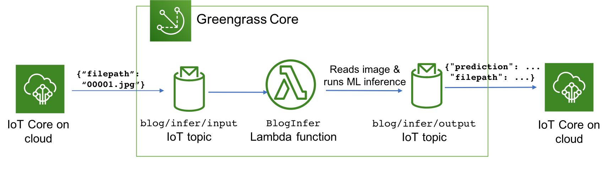
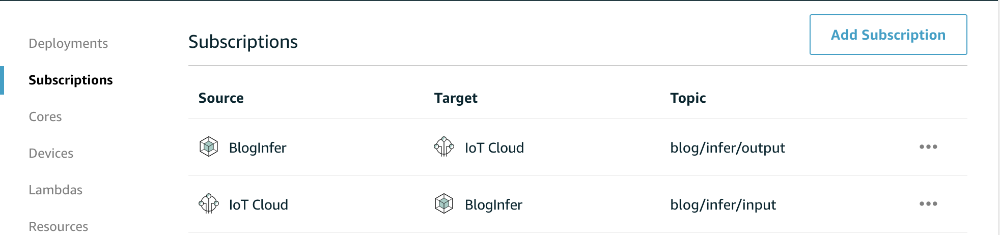
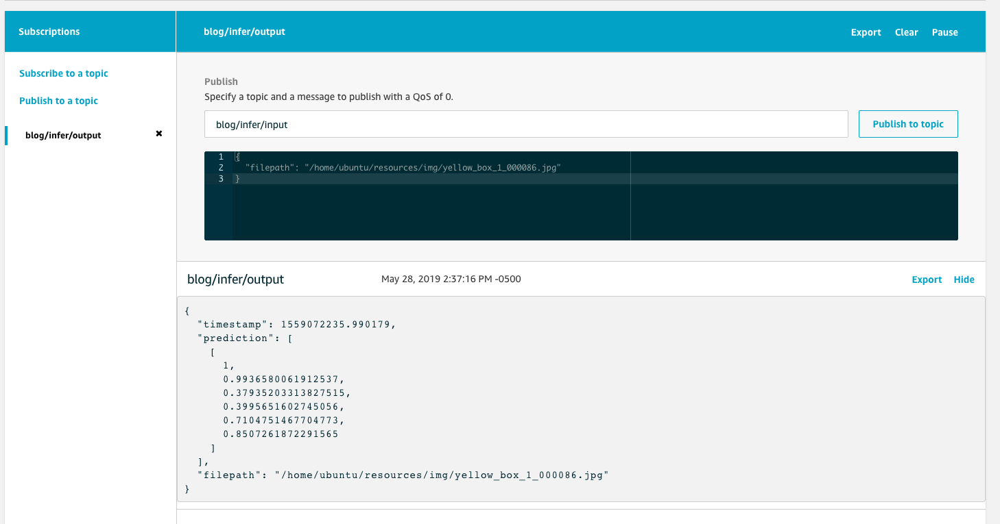

# Deploy Object Detection model to the edge

- [Prereqs](#prereqs)
- [Set up environment and AWS IoT Greengrass Core on edge device](#set-up-environment-and-aws-iot-greengrass-core-on-edge-device)
  * [Install machine learning dependencies on the device](#install-machine-learning-dependencies-on-the-device)
  * [Set up environment and install AWS IoT Greengrass software](#set-up-environment-and-install-aws-iot-greengrass-software)
  * [Create an IoT greengrass group using Greengo](#create-an-iot-greengrass-group-using-greengo)
  * [Start AWS IoT greengrass core](#start-aws-iot-greengrass-core)
  * [Initial IoT Greengrass group deployment](#initial-iot-greengrass-group-deployment)
- [Test inference code on device directly - Optional](#unittest)
- [Creating your inference pipeline in AWS IoT Greengrass Core](#creating-your-inference-pipeline-in-aws-iot-greengrass-core)
  * [Configure ML resource in IoT greengrass using greengo](#configure-ml-resource-in-iot-greengrass-using-greengo)
  * [Configure lambda function with greengo](#configure-lambda-function-with-greengo)
  * [Using GPU-Enabled devices](#using-gpu-enabled-devices)
  * [Configure topic subscriptions with greengo](#configure-topic-subscriptions-with-greengo)
  * [Test IoT Greengrass lambda function](#test-iot-greengrass-lambda-function)

<small><i><a href='http://ecotrust-canada.github.io/markdown-toc/'>Table of contents generated with markdown-toc</a></i></small>


## Prereqs

Refer to the [Greengrass requirements page](https://docs.aws.amazon.com/greengrass/latest/developerguide/gg-gs.html#gg-requirements) 

## Set up environment and AWS IoT Greengrass Core on edge device

### Install machine learning dependencies on the device

If your device has GPU, make sure you have the GPU drivers, such as [CUDA](https://developer.nvidia.com/cuda-downloads), installed. If your device only has CPU, you can still run the inference but with slower performance. 

The built-in SageMaker object detection model is written in MXNet. To run inference on the edge, you need to install the mxnet library on your device. Refer to the [MXNet install documentation](http://mxnet.incubator.apache.org/versions/master/install/) for the version that matches the CUDA driver. For example, we installed CUDA 10.1 on the Ubuntu instance, so we installed `mxnet-cu101`

```
$ sudo pip2 install mxnet-cu101 # on a GPU enabled device with CUDA 10.1

```

If you are using a CPU only device, simply install `mxnet`

```
$ sudo pip2 install mxnet  # on a CPU only device
```


Since OpenCV is also fairly large dependency, let's install it on our device too:

```
$ sudo pip2 install opencv-python
```

> Note 1: The reason we use sudo here is because IoT Greengrass runs under `ggc_user`. Regular pip install will install it under your OS user, which `ggc_user` won’t have access to. Alternatively you could install the packages somewhere else as long as `ggc_user` can access that directory.
> 
> Note 2: The reason we use `pip2` here is because we use `greengo` in this blog to set up Greengrass, which only supports python2 at the moment. 

Verify the dependencies are set up correctly by running: 

```
$ python -c "import cv2"
$ python -c "import mxnet"
```

### Set up environment and install AWS IoT Greengrass software

Follow the "Module 1" in [this documentation](https://docs.aws.amazon.com/greengrass/latest/developerguide/module1.html) to set up your device to run AWS IoT Greengrass. Do not proceed to Module 2 as we will be using [Greengo](https://github.com/dzimine/greengo) to setup the greengrass group instead of the AWS console. 

Download the version of the [Greengrass Core software](https://docs.aws.amazon.com/greengrass/latest/developerguide/what-is-gg.html#gg-core-download-tab) you want to install to the edge device, and unzip it to `/`

For example: 

```bash
$ wget https://d1onfpft10uf5o.cloudfront.net/greengrass-core/downloads/1.9.2/greengrass-linux-x86-64-1.9.2.tar.gz
$ sudo tar -xzvf greengrass-linux-x86-64-1.9.2.tar.gz -C /
$ ls /greengrass/
certs  config  ggc  ota
```

### Create an IoT greengrass group using Greengo

On your laptop/workstation, git clone this repo. In the `greengrass/` folder, you will a see  `greengo.yaml` file, which defines configurations and lambda functions for an IoT Greengrass Group. The top portion of the file defines the name of the IoT Greengrass Group and IoT Greengrass Cores:

```
Group:
  name: GG_Object_Detection
Cores:
  - name: GG_Object_Detection_Core
    key_path: ./certs
    config_path: ./config
    SyncShadow: True
```

For the initial setup of the IoT Greengrass Group resources in AWS IoT, run this command below in the folder that `greengo.yaml` lives in.

```
`pip install greengo
greengo create`
```

 This creates all greengrass group artifacts in AWS and places the certificates and `config.json `for IoT Greengrass Core in `./certs/` and `./config/.` It will also generate a state file in `.gg/gg_state.json` that references all the right resources during deployment: 

```
├── .gg
│   └── gg_state.json
├── certs
│   ├── GG_Object_Detection_Core.key
│   ├── GG_Object_Detection_Core.pem
│   └── GG_Object_Detection_Core.pub
├── config
│   └── config.json
```

Copy the `certs` and `config` folder to the edge device (or test EC2 instance) using [scp](https://linux.die.net/man/1/scp), and then copy them to the `/greengrass/certs/` and `/greengrass/config/`  directories on the device

```
sudo cp certs/* /greengrass/certs/
sudo cp config/* /greengrass/config/
```

On your device, also download the root CA certificate compatible with the certificates Greengo generated to the `/greengrass/certs/` folder:

```
`cd /greengrass/certs/
sudo wget -O root.ca.pem https://www.symantec.com/content/en/us/enterprise/verisign/roots/VeriSign-Class%203-Public-Primary-Certification-Authority-G5.pem`
```


### Start AWS IoT greengrass core

Now we are ready to start the IoT Greengrass Core daemon on the edge device. 

```
$ sudo /greengrass/ggc/core/greengrassd start
Setting up greengrass daemon
Validating hardlink/softlink protection
Waiting for up to 1m10s for Daemon to start

Greengrass successfully started with PID: 4722
```

### Initial IoT Greengrass group deployment 

Once the IoT Greengrass daemon is up and running, return to where you have downloaded the code repo from GitHub on your laptop/workstation, then go to the `greengrass` folder (where `greengo.yaml` resides) and run:

```
$ greengo deploy
```

This will deploy the configurations you define in `greengo.yaml` to the IoT Greengrass Core on the edge device.  So far we haven't defined any Lambda functions yet in our Greengo configuration, so this deployment just initializes the IoT Greengrass Core. We will add a Lambda function to our IoT Greengrass set up after we do a quick sanity test in the next step.

## <a name="unittest"></a>Test inference code on device directly (Optional) 

Although an optional step, it’s always helpful to run a quick test on our edge device to verify that the non-Greengrass dependencies (MXNet, etc.) has been set up properly on the device. 

We have written a unit test `test_model_loader.py` that will test the `MLModel` class above. Review the code [here](https://github.com/aws-samples/amazon-sagemaker-aws-greengrass-custom-object-detection-model/blob/master/greengrass/run_model/test/test_model_loader.py). 

To run the unit test, download the code and ML model artifacts to the edge device and kick off the unit test: 

```
git clone https://github.com/aws-samples/amazon-sagemaker-aws-greengrass-custom-object-detection-model.git
cd amazon-sagemaker-aws-greengrass-custom-object-detection-model/greengrass/run_model/resources/ml/od
wget https://greengrass-object-detection-blog.s3.amazonaws.com/deployable-model/deploy_model_algo_1-0000.params
cd ../../..
python2 -m unittest test.test_model_loader.TestModelLoader
```

After the unit tests pass, we can now review how this code can be used inside of a Greengrass Lambda function. 

## Creating your inference pipeline in AWS IoT Greengrass Core 

Now that we have started IoT Greengrass and tested our inference code on the edge device, we are ready to put it all together: create an Greengrass Lambda function that will run the inference code inside Greengrass Core. 

In order to test the IoT Greengrass Lambda function for inference, we will create the following pipeline: 



* A lambda function running in IoT Greengrass Core `BlogInfer` that contains the object detection inference code 
* The AWS IoT topic `blog/infer/input` will provide input to the `BlogInfer` Lambda function for the location of the image file on the edge device to do inference on
* The IoT topic `blog/infer/output` will publish the prediction output the `BlogInfer` Lambda function to the AWS IoT message broker in the cloud 


### Configure ML resource in IoT greengrass using greengo

To simplify the process of deploying new ML model artifact to the edge, AWS IoT Greengrass supports the management of **[machine learning resources](https://docs.aws.amazon.com/greengrass/latest/developerguide/ml-inference.html).**
 
To define the machine learning resource in your IoT Greengrass group, simply uncomment this section in your `greengo.yaml` file (If you want to use your own model, replace the `S3Uri` with your own values)

```
Resources:
  - Name: MyObjectDetectionModel
    Id: MyObjectDetectionModel
    S3MachineLearningModelResourceData:
      DestinationPath: /ml/od/     
      S3Uri: s3://greengrass-object-detection-blog/deployable-model/deploy_model.tar.gz
```

If you deploy your IoT Greengrass group at this stage (using `greengo update && greengo deploy`) you can see a ML resource created for you in the IoT Greengrass console: 

> When you need to troubleshoot a ML resource deployment, it's helpful to remember that IoT Greengrass has a containerized architecture and uses filesystem overlay when it deploys resources such as ML model artifacts. In the example above, even though we configured the ML model artifacts to be extracted to `/ml/od/`, IoT Greengrass actually downloads it to something like `/greengrass/ggc/deployment/mlmodel/<uuid>/`. However, to your IoT Greengrass local Lambda function that you declare to use this artifact, the extracted files will appear to your lambda code to be stored in `/ml/od` due to the filesystem overlay. 

### Configure lambda function with greengo 

To configure your Lambda function and give it access to the machine learning resource we defined above, uncomment your `greengo.yaml` : 

```
Lambdas:
  - name: BlogInfer
    handler: main.lambda_handler
    package: ./run_model/src
    alias: dev
    greengrassConfig:
      MemorySize: 900000 # Kb
      Timeout: 10 # seconds
      Pinned: True # True for long-lived functions
      Environment:
        AccessSysfs: True
        ResourceAccessPolicies:
          - ResourceId: MyObjectDetectionModel
            Permission: 'rw'
```

Note that we didn't specify the language runtime for the Lambda function. This is because at the moment the Greengo project only supports Lambda functions running python2.7. 

Also note that if your edge device doesn't already have greengrasssdk installed, you can install greengrasssdk to the `./run_model/src/` directory and have it be included in the Lambda deployment package: 

```
$ cd run_model/src/
$ pip install greengrasssdk - t .
```

### Using GPU-Enabled devices 

If you are using a CPU-only device, you can skip to the next section. 

If you are using an edge device or instance with GPU, you must enable the Lambda function to access the GPU devices, using the [local resources feature](https://docs.aws.amazon.com/greengrass/latest/developerguide/access-local-resources.html) of Greengrass. 

To define the device resource in `greengo.yaml`, uncomment the section under *Resources*:

```
  - Name: Nvidia0
    Id: Nvidia0
    LocalDeviceResourceData:
      SourcePath: /dev/nvidia0
      GroupOwnerSetting:
        AutoAddGroupOwner: True
  - Name: Nvidiactl
    Id: Nvidiactl
    LocalDeviceResourceData:
      SourcePath: /dev/nvidiactl
      GroupOwnerSetting:
        AutoAddGroupOwner: True
  - Name: NvidiaUVM
    Id: NvidiaUVM
    LocalDeviceResourceData:
      SourcePath: /dev/nvidia-uvm
      GroupOwnerSetting:
        AutoAddGroupOwner: True
  - Name: NvidiaUVMTools
    Id: NvidiaUVMTools
    LocalDeviceResourceData:
      SourcePath: /dev/nvidia-uvm-tools
      GroupOwnerSetting:
        AutoAddGroupOwner: True
```

To enable the inference Lambda function to access the device resources, uncomment the below section inside the *ResourceAccessPolicies* of the Lambda function 

```
         - ResourceId: Nvidia0
           Permission: 'rw'
         - ResourceId: Nvidiactl
           Permission: 'rw'
         - ResourceId: NvidiaUVM
           Permission: 'rw'
         - ResourceId: NvidiaUVMTools
           Permission: 'rw'
```

### Configure topic subscriptions with greengo 

Lastly, in order for us to test invoking the inference Lambda function and receiving its outputs, we can create subscriptions for inputs and outputs for the inference lambda function by uncommenting this section in your `greengo.yaml` : 

```
Subscriptions:
# Test Subscriptions from the cloud
- Source: cloud
  Subject: blog/infer/input
  Target: Lambda::BlogInfer
- Source: Lambda::BlogInfer
  Subject: blog/infer/output
  Target: cloud
```

To deploy these configurations to IoT Greengrass, simply run 

```
$ greengo update && greengo deploy
```


Once the deployment is finished, you can also review the subscription configuration in the IoT Greengrass console:



And if you check the Lambda function that was deployed, you can see the ML resource is now Affiliated to it。

### Test IoT Greengrass lambda function 

Now we can test invoking our Lambda function! Ensure you download an image ([example](https://github.com/aws-samples/amazon-sagemaker-aws-greengrass-custom-object-detection-model/raw/master/greengrass/run_model/resources/img/yellow_box_1_000086.jpg)) to your edge device, so you can use it to test the inference. 

In the IoT console, using the **Test** tab, subscribe to the `blog/infer/output` topic. Then publish a message `blog/infer/input` specifying the path of the image to do inference on the edge device: 




You should have gotten back bounding box prediction results! 

